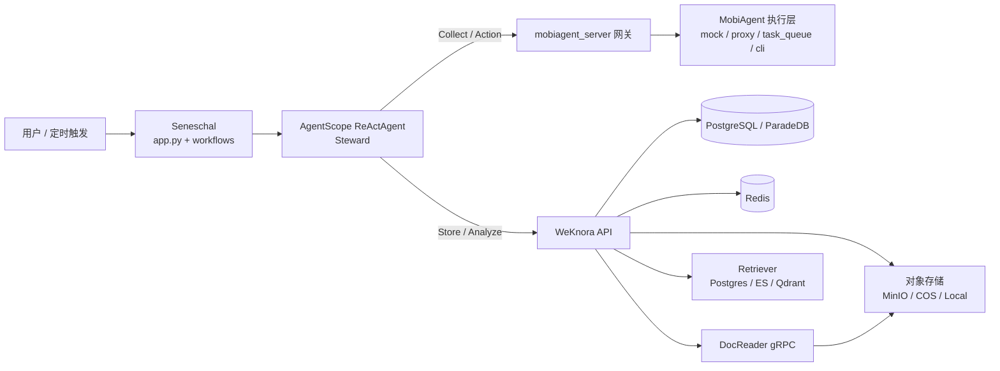
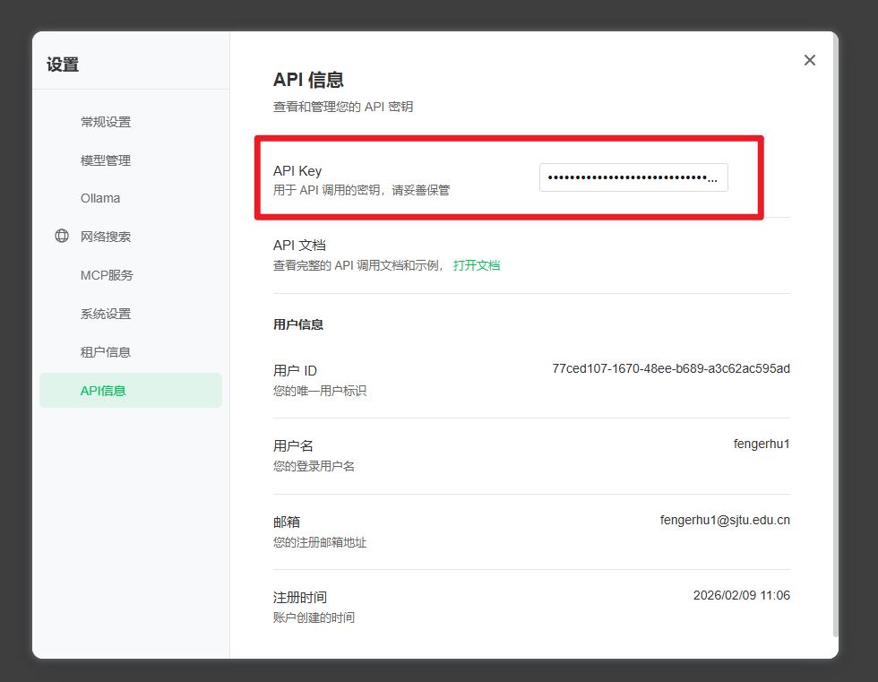

# Seneschal 启动指南

本项目将 **AgentScope / WeKnora / MobiAgent** 组合为个人数据管家系统。下面是推荐的启动顺序与配置流程。

---

## 项目简化架构图（1页版）



核心闭环：`Collect -> Store -> Analyze -> Execute`

- `Collect`：Seneschal 通过网关调用 MobiAgent 采集手机侧数据  
- `Store`：将采集结果写入 WeKnora 知识库  
- `Analyze`：基于 WeKnora 的 RAG/Agent 能力生成总结与决策  
- `Execute`：按分析结果回调 MobiAgent 执行动作  

更多细节可查看：

- `docs/Seneschal-简化架构图.md`（1页版说明）
- `docs/Seneschal-项目架构说明.md`（详细版）

---

## 1. 下载仓库并拉取子仓库

```bash
git clone <repo-url>
cd ./Seneschal
git submodule update --init --recursive
```

---

## 2. 启动并部署 WeKnora（快速开发模式）

进入WeKnora目录，设置`.env`环境，可以开启MINIO和NEO4J

```bash
cd WeKnora
cp .env.example .env
```


方式 1：首次启动，使用 Make 命令（[推荐](https://github.com/Tencent/WeKnora/blob/main/README_CN.md)），并且提前安装了GO.

```bash
cd WeKnora
make dev-start      # 启动基础设施
make dev-app        # 启动后端（新终端）
make dev-frontend   # 启动前端（新终端）
```

方式 2：一键启动

```bash
./scripts/quick-dev.sh
```

方式 3：使用脚本

```bash
./scripts/dev.sh start     # 启动基础设施
./scripts/dev.sh app       # 启动后端（新终端）
./scripts/dev.sh frontend  # 启动前端（新终端）
```

---

## 2.1 部署并启动 Rerank 模型服务

在 `WeKnora` 目录执行：

```bash
cd WeKnora
modelscope download --model BAAI/bge-reranker-v2-m3 --local_dir bge-reranker-v2-m3
python rerank_server_bge-reranker-v2-m3.py
```

默认监听端口：`8001`

---

## 3. 修改并导入 WeKnora 配置

根据注册用户名（或租户）修改 `configs/` 目录下的配置文件（租户信息默认 `tenant_id=10000`）：

- `configs/custom_agents_export.json`
- `configs/knowledge_bases_export.json`
- `configs/models_export.json`
- `configs/tenants_export.json`
- `configs/users_export.json`

可登录前端页面：
默认用户
- 用户名：flyboy@outlook.com
- 密码：flyboy123456

修改完成后执行一键导入：

```bash
ENV_FILE=./.env \
CONFIG_DIR=./configs \
bash ./scripts/weknora_import.sh
```

导入完成会输出校验结果：
```
Import completed. models=... knowledge_bases=... custom_agents=...
```

在修改完成后，可以执行备份指令备份配置文件到backup目录下，便于项目修改或者迁移：

```bash
OUT_DIR=./backup ./scripts/weknora_export.sh
```

记录WeKnora的 **API Key**，后续配置需要使用，API key如下图所示（登录5173端口的前端界面，登录账号后获取）



---

## 4. 配置环境变量并同步依赖

激活并同步 uv 环境：

```bash
uv sync
```

可先使用模板文件初始化环境变量：

```bash
cp .env-example .env
```

 `.env-example` 中的Key字段，需要提前在**终端中export，禁止写在env文件中**：
- `OPENROUTER_API_KEY`，以`sk-or-v1-`开头
- `WEKNORA_API_KEY`（首次初始化可自行填写；该值会导入租户配置，并作为后续访问 WeKnora API 的认证密钥，以`sk-`开头）
- `BRAVE_API_KEY`（Worker 进行联网新闻/网页搜索时必需，需要挂**代理**）
- `WEKNORA_MODEL_EMBEDDING_API_KEY`，当前使用openrouter提供的服务，因此无需额外指定


其他变量说明：
- `OPENROUTER_*` 用于 `mobiagent_server` 解析 output_schema（VL 抽取）。
- `WEKNORA_*` 用于知识库写入与 RAG 分析。
- `BRAVE_*` 用于 Worker 的联网新闻与网页来源检索。
- `MOBIAGENT_*` 用于网关联通端侧 MobiAgent CLI。
- `MOBIAGENT_CLI_CMD` 中的 `service_ip` / 端口参数（按你的设备环境修改）
---

## 5. 运行 MobiAgent Server

网关负责接收统一 API（`/api/v1/collect` / `/api/v1/action`），并调用 MobiAgent CLI 或者其他GUI-Agent 执行手机侧任务，以实现解耦替换和便于调试测试。

```bash
python -m mobiagent_server.server
```

默认监听：`http://localhost:8081`

---

## 6. 手机交互模式

### 6.0 一键拉取/部署/启动（含 WeKnora + Demo）

```bash
# 在env-example或者终端中export WEKNORA_API_KEY、OPENROUTER_API_KEY（联网检索场景还需 BRAVE_API_KEY）后执行下面的脚本
bash ./scripts/bootstrap_one_click.sh
```

该脚本会自动执行以下步骤：
- `git pull` + `git submodule update`
- 启动 WeKnora 基础设施 / 后端 / 前端（可选）
- 下载并启动 `BAAI/bge-reranker-v2-m3` 服务（默认端口 `8001`）
- 导入 `backup/` 下 WeKnora 配置（可选）
- 启动 `mobiagent_server`
- 运行 `app.py` demo
- 根据.env-example创建.env文件
- 同步uv的环境

启动前会检查端口占用，若任一必需端口被占用会直接退出并提示。

默认检查端口（按当前脚本）：
- WeKnora: `5432` `6379` `50051` `8080` `5173`
- Rerank: `8001`
- MobiAgent Gateway: `8081`
- WeKnora full profile 依赖: `9000` `9001` `6333` `6334` `7474` `7687` `16686` `4317`

可选环境变量：
- `SKIP_PULL=1`：跳过 `git pull`
- `SKIP_IMPORT=1`：跳过 WeKnora 配置导入
- `SKIP_FRONTEND=1`：跳过 WeKnora 前端启动
- `SKIP_RERANK=1`：跳过 Rerank 模型下载和启动
- `RERANK_PORT=xxxx`：指定 Rerank 端口（默认 `8001`）

#### 6.0.1 一键关闭全部服务

```bash
bash ./scripts/stop_all.sh
```

该脚本会尝试停止：
- WeKnora（`dev.sh stop` 基础设施）
- `mobiagent_server`（如有）
- `rerank_server_bge-reranker-v2-m3`（如有）
- WeKnora 本地 app/frontend（如有）

### 6.1 运行 Demo 对话

```bash
python app.py
```

### 6.2 交互模式

```bash
python app.py --interactive
```

### 6.3 运行 Daily Loop

```bash
python app.py --daily --daily-trigger daily
```

## 7. Worker模式（浏览器 + 本地工具）

该工作流只接收任务描述并交给 Worker Agent 决策，是否调用浏览器/本地工具由 Agent 自行判断。
联网搜索默认采用 Brave Search：先检索候选来源链接与摘要，再按需抓取网页正文。
实现见 [seneschal/workflows.py](seneschal/workflows.py)。

```bash
python app.py --agent-task "帮我查看今天美伊战争的情况总结，并且生成对应的md总结"
```

如果需要指定输出路径，可提供 `--output`（Agent 会优先遵循）：

```bash
python app.py --agent-task "帮我查看今天美伊战争的情况总结，并且生成对应的md总结" --output "outputs/summart.md"
```

示例：每天从 arXiv 搜索最新的 Agent 相关论文并生成 Markdown 总结（可由 cron 定时调用）：

```bash
python app.py --agent-task "从 arXiv 搜索最新的 Agent 相关论文，下载并阅读 PDF，生成并保存论文摘要与要点，以markdown的格式，" --output "outputs/papers/agent_arxiv_daily.md"
```

示例：查看近三年 OSDI 会议上关于 Agent 的论文并作总结：

```bash
python app.py --agent-task "帮我查看近三年 OSDI 会议上关于 端侧大模型推理 的相关论文，总结论文的设计与实现，并以markdown格式保存" --output "outputs/papers/osdi_agent_last3years.md"
```

Shell 工具默认受白名单限制，若你设置了 `SENESCHAL_SHELL_ALLOWLIST`，请按需加入允许的命令。
如需限制写文件路径，可设置 `SENESCHAL_FILE_WRITE_ROOT`。

## 8. Gateway模式（类似OpenClaw Core 入口）

网关用于接收任务并交给 Steward Agent 处理，支持同步和异步任务查询。

```bash
python -m seneschal.gateway_server
```

默认监听：`http://0.0.0.0:8090`

可选环境变量：
- `SENESCHAL_GATEWAY_PORT`：自定义端口（默认 `8090`）
- `SENESCHAL_GATEWAY_API_KEY`：网关鉴权（Bearer token）

也可以直接运行示例脚本（无需手动启动gateway_server服务）：

```bash
bash ./scripts/run_gateway_demo.sh
```

---

## 9. 其他请求示例（网关）

### 9.1 MobiAgent Server：Collect

为支持完整任务执行的场景。

```bash
curl -X POST http://localhost:8081/api/v1/collect \
  -H "Authorization: Bearer <MOBI_AGENT_API_KEY>" \
  -H "Content-Type: application/json" \
  -d '{"task":"获取微信聊天列表前5条摘要"}'
```

### 9.2 MobiAgent Server：Action + output_schema

为支持特定操作、单步操作场景预留接口和请求格式。
```bash
curl -X POST http://localhost:8081/api/v1/action \
  -H "Authorization: Bearer <MOBI_AGENT_API_KEY>" \
  -H "Content-Type: application/json" \
  -d '{
    "action_type": "add_calendar_event",
    "params": {
      "title": "产品评审",
      "date": "2025-02-01",
      "time": "15:00",
      "output_schema": {
        "title": "string",
        "date": "string",
        "time": "string",
        "success": "boolean"
      }
    },
    "options": {"wait_for_completion": true, "timeout": 60}
  }'
```

### 9.3 Seneschal Gateway Task

用于触发 OpenClaw Core（Steward Agent）任务。

```bash
curl -X POST http://localhost:8090/api/v1/task \
  -H "Content-Type: application/json" \
  -d '{"task":"整理今日待办并给出简要总结","async_mode":false}'
```

异步任务：

```bash
curl -X POST http://localhost:8090/api/v1/task \
  -H "Content-Type: application/json" \
  -d '{"task":"检索近期会议安排并总结","async_mode":true}'

curl http://localhost:8090/api/v1/jobs/<job_id>
```

如果启用鉴权：

```bash
curl -X POST http://localhost:8090/api/v1/task \
  -H "Authorization: Bearer <SENESCHAL_GATEWAY_API_KEY>" \
  -H "Content-Type: application/json" \
  -d '{"task":"给出今天的提醒事项","async_mode":false}'
```

---

## 10. 常见问题

**Q1: WeKnora 已启动，还需要做什么？**  
A: 修改填写对应的模型、API配置后，一键导入[修改并导入 WeKnora 配置](#3-修改并导入-weknora-配置)；确保 `WEKNORA_BASE_URL` / `WEKNORA_API_KEY` / `WEKNORA_KB_NAME` 已经填写、有效，后续 Seneschal 会通过API接口直接写入知识库与查询。

**Q2: MobiAgent CLI 运行很慢、指令执行错误怎么办？**  
A: 可先把 `MOBIAGENT_SERVER_MODE=mock`，等模型与设备调试就绪后再切回 `cli`。

---

## 模块说明（MobiClaw Core）

- `seneschal/agents.py`：核心 Steward/Worker Agent，含任务编排、工具注册、A2A 委派。
- `seneschal/tools/`：工具层封装（MobiAgent/WeKnora/Web/Shell）。
- `seneschal/gateway_server.py`：OpenClaw Core 的常驻网关入口（HTTP 任务接收）。
- `mobiagent_server/`：手机端操作网关（collect/action），支持 mock / proxy / cli。
- `seneschal/workflows.py`：演示与交互式流程入口。
- `app.py`：主入口（加载 .env，运行 workflows）。
- `scripts/run_gateway_demo.sh`：网关示例脚本，快速验证任务链路。


---

## WeKnora 配置参考

### 一键导出（模型 / 知识库 / 智能体）

使用脚本统一导出三类配置（JSON）：

```bash
./scripts/weknora_export.sh
```

默认会生成：
- `models_export.json`
- `knowledge_bases_export.json`
- `custom_agents_export.json`

说明：
- 智能体导出优先走 API（包含内置智能体），因此需确保已加载 `.env` 中的 `WEKNORA_BASE_URL` / `WEKNORA_API_KEY`，若没有也会会退到数据库读取。
- 也可使用环境变量覆盖容器名或输出目录：
  - `CONTAINER_NAME`（默认 `WeKnora-postgres-dev`）
  - `DB_NAME`（默认 `WeKnora`）
  - `DB_USER`（默认 `postgres`）
  - `OUT_DIR`（默认当前目录）

示例：
```bash
OUT_DIR=./backup ./scripts/weknora_export.sh
```

### 一键导入（模型 / 知识库 / 智能体）

使用脚本一键导入（自动压缩 JSON、拷贝到容器、导入并校验数量）：

```bash
ENV_FILE=./.env \
CONFIG_DIR=./configs \
bash ./scripts/weknora_import.sh
```

脚本导入完成后会输出校验结果：
```
Import completed. models=... knowledge_bases=... custom_agents=...
```

如需仅导入某一类配置，可保留对应文件路径，其它参数使用默认路径或修改为空路径即可。
