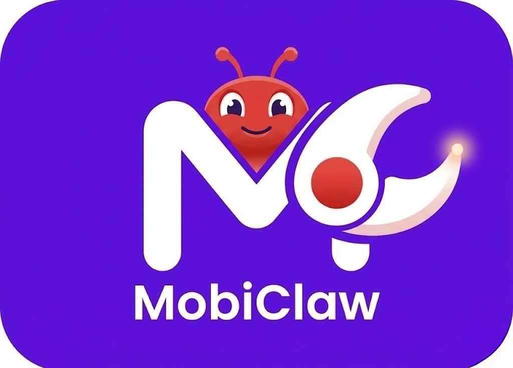

<div align="center">
  <picture>
    
  </picture>
</div>

<h3 align="center">
MobiClaw: A Lightweight OpenClaw Alternative with Seamless Mobile Manipulation
</h3>

---

MobiClaw 是轻量化的openClaw替代，能够支持网页搜索，文档生成，论文查找，定时任务，飞书机器人，skill注入，多智能体编排等核心功能，同时可以和 [MobiAgent](https://github.com/IPADS-SAI/MobiAgent) 对接，获取更强的手机控制与交互能力，实现端侧设备任务下发 - 控制 - 消息获取的端到端闭环。

当前主链路已经扩展为“**Router + Planner + Skill Selector + Executor**”的多智能体编排模型：

- **编排入口**：`app.py` + `mobiclaw/workflows.py`
- **编排核心**：`mobiclaw/orchestrator/`（execution / routing / skills / runner）
- **智能体**：`mobiclaw/agents/`（Steward / Worker / Router / Planner / Skill Selector / User / etc.）
- **工具层**：`mobiclaw/tools/`（mobi / web / shell / file / papers / office / etc.）
- **手机网关**：`mobiagent_server/server.py`（collect / action / jobs）
- **任务网关**：`mobiclaw/gateway_server/`（统一任务入口、异步任务、文件下载、飞书接入）
- **定时任务**：`mobiclaw/dailytasks/runner.py`
- **Skill 库**：`mobiclaw/skills/*/SKILL.md`

---

## 演示视频

<div align="center">
  <video src="https://github.com/user-attachments/assets/566821b0-5771-4907-b04e-8005094b0758"/>
</div>

---

## 文档导航

- 架构总览：`docs/MobiClaw-简化架构图.md`
- 架构详解：`docs/MobiClaw-项目架构说明.md`
- 详细分层图：`docs/MobiClaw-详细架构图.md`
- 详细项目拆解：`docs/MobiClaw-详细项目分析与拆解.md`
- 改进路线图：`docs/MobiClaw-改进路线图.md`
- 子模块文档：
  - `docs/模块-mobiclaw-core.md`
  - `docs/模块-tools.md`
  - `docs/模块-dailytasks.md`
  - `docs/模块-gateway.md`

---

## 当前运行模式概览

`python app.py` 统一从 `mobiclaw/workflows.py` 进入，按参数分为 3 种模式：

- **`--interactive`**：交互模式，终端多轮对话
- **`--daily --daily-trigger <trigger>`**：每日任务模式，也可通过--agent-task通过自然语言下发定时任务
- **`--agent-task "..."(推荐) `**：多智能体任务模式，会选择一个或者多个合适的智能体完成任务


---

## 从 0 到运行（推荐路径）

### 0) 基于Claude code + MobiClaw Skill 自动安装

如果你希望让Claude Code自动完成项目的环境配置与安装，可以在项目根目录启动 `claude`，然后输入 `/setup`，Claude Code会：

- 检查本地环境
- 安装项目依赖
- 交互式完成选项配置（如选择模型，接入飞书，配置可选项等）
- 在后台启动gateway server

在此过程中，随时与Claude Code聊天来进行任何你想要的个性化定制。

若你不想使用Claude Code，或者希望自主控制项目的安装过程，你也可以按照下面的步骤手动安装项目：

### 1) 拉取代码与子模块

```bash
git clone <repo-url>
cd MobiClaw
git submodule update --init --recursive
```

### 2) 安装 Python 依赖

```bash
uv sync

# 安装 tesseract 中文包，用于后续可能的 OCR 需求（可选）
sudo apt-get update
sudo apt-get install -y tesseract-ocr-chi-sim
```

项目要求 Python 3.12+。

### 3) 配置环境变量

```bash
cp .env-example .env
```

然后至少补齐以下变量：

```bash
# LLM（必需）
export OPENROUTER_API_KEY='...'
# 或者：export OPENAI_API_KEY='...'

# Brave Search（联网搜索，需要代理）
export BRAVE_API_KEY='...'
```

常用补充项：

```bash
export OPENROUTER_MODEL='google/gemini-3-flash-preview'
export OPENROUTER_BASE_URL='https://openrouter.ai/api/v1'
export MOBI_AGENT_BASE_URL='http://localhost:8081'
```

`app.py` 与 `mobiclaw/gateway_server/` 启动时都会自动读取根目录 `.env`，仅在环境变量尚未存在时补齐。


### 4) 本地运行 MobiClaw

#### 4.1 交互模式

```bash
python app.py --interactive
```

输入 `exit` / `quit` / `退出` 可结束。

#### 4.2 Agent Task 模式

通过`--mode`指定具体的Agent：
```bash
python app.py --agent-task "从 arXiv 搜索今天的 Agent 论文并总结" --mode worker
```

#### 4.2.1 配置驱动自定义 Agent

当前支持通过配置文件自动注册自定义 Agent，并默认参与 Router/Planner 的候选集合。

- 配置文件路径：`mobiclaw/configs/custom_agent.json`
- 可选覆盖：环境变量 `MOBICLAW_CUSTOM_AGENT_CONFIG_PATH`
- 加载时机：进程启动加载一次
- 校验策略：`tools` 严格校验；若包含未知工具名，该 Agent 会被跳过并记录 warning

配置项说明：

- 必填字段：
- `agent_name`：Agent 名称（路由标识，内部会标准化为小写）
- `role`：该 Agent 的职责描述（供 Router 能力画像使用）
- `system_prompt`：该 Agent 的系统提示词
- 可选字段：
- `tools`：工具名列表（必须来自系统已注册工具名）
- `strengths`：能力优势列表
- `typical_tasks`：典型任务列表
- `boundaries`：能力边界列表
- `model_name`：该 Agent 专用模型（不填则沿用默认模型）
- `temperature`：该 Agent 温度参数
- `max_iters`：该 Agent 最大迭代轮数（1-50）

示例：

```json
{
  "agents": [
    {
      "agent_name": "research_assistant",
      "role": "负责论文与网页信息的深度检索和结构化总结",
      "system_prompt": "你是 MobiClaw 的 Research Assistant。你只处理检索、阅读、对比与总结类任务。",
      "tools": [
        "brave_search",
        "fetch_url_readable_text",
        "arxiv_search",
        "download_file",
        "extract_pdf_text"
      ],
      "strengths": ["跨来源信息检索与交叉验证"],
      "typical_tasks": ["检索并总结某个主题的最新论文"],
      "boundaries": ["不执行手机 GUI 操作"],
      "temperature": 0.2,
      "max_iters": 12
    }
  ]
}
```

使用方式：

- 自动路由：提交普通任务即可，Router 会把它作为候选 Agent
- 显式指定：可通过 `agent_hint` / `--agent-hint` 直接指定自定义 Agent

#### 4.2.2 Skill 自动选择

- 发现方式：扫描 `mobiclaw/skills/*/SKILL.md`
- 召回方式：规则召回 + 可选 LLM 重排
- 注入方式：把 skill 摘要注入目标 Agent 的 prompt 上下文
- 手动覆盖：支持 `--skill-hint`
- 可观测性：结果中的 `routing_trace.skills.records` 会记录候选、来源、原因和最终选择
- 当前 `routing_trace` 还会记录 `planner_allowed_agents` 等规划约束信息，方便定位路由与规划偏差

#### 4.2.3 `--agent-task` 常见示例

##### 智能路由多智能体模式（Router + Planner + Executor）

当前 `app.py --agent-task` 与 `gateway /api/v1/task` 默认都走统一编排：
- Router Agent：根据任务语义选择目标 Agent（LLM 语义路由 + 规则兜底）
- Planner Agent：复合任务自动拆分为阶段子任务（串并行混合）
- Executor：将子任务分发给 `Steward` / `Worker` / 其他Agent 执行并聚合结果
- Skill Selector：为每个子任务自动选择最合适的 Skill（规则召回 + LLM 重排，可为空）

联网搜索默认采用 Brave Search：先检索候选来源链接与摘要，再按需抓取网页正文。
实现见 [mobiclaw/workflows.py](mobiclaw/workflows.py) 与 [mobiclaw/orchestrator/](mobiclaw/orchestrator/)。

```bash
# 默认多智能体路由
python app.py --agent-task "帮我查看今天美伊战争的情况总结，并且生成对应的 md 总结"
```

```bash
python app.py --agent-task "帮我查看今天美伊战争的情况总结，并且生成对应的md总结"
```

如果需要指定输出路径，可提供 `--output`（Agent 会优先遵循）：

```bash
python app.py --agent-task "帮我查看今天美伊战争的情况总结，并且生成对应的md总结" --output "outputs/summart.md"
```

示例：每天从 arXiv 搜索最新的 Agent 相关论文并生成 Markdown 总结（可由 cron 定时调用）：

```bash
python app.py --agent-task "从 arXiv 搜索最新的 Agent 相关论文，下载并阅读 PDF，生成并保存论文摘要与要点，以markdown的格式，" --output "outputs/papers/agent_arxiv_daily.md"
```

示例：查看近三年 OSDI 会议上关于 Agent 的论文并作总结：

```bash
python app.py --agent-task "帮我查看近三年 OSDI 会议上关于 端侧大模型推理 的相关论文，总结论文的设计与实现，并以markdown格式保存" --output "outputs/papers/osdi_agent_last3years.md"

# 强制走 legacy 单 Agent 模式（兼容）
# 指定输出路径
python app.py --agent-task "帮我查看今天美伊战争的情况总结，并且生成对应的 md 总结" --output "outputs/summary.md"

# 直接走单 Agent 模式, 涉及手机的任务会自动选择对应工具调用手机
python app.py --agent-task "帮我看一下微信最近的未读消息" --mode steward 
python app.py --agent-task "帮我检索最新 Agent 论文" --mode worker

# 给 Router 提示偏好 Agent
python app.py --agent-task "整理并补充今日行动建议" --agent-hint steward

# 手动指定 skill（优先级高于自动选择，支持逗号分隔）
python app.py --agent-task "做一个内部周报草稿" --skill-hint internal-comms
python app.py --agent-task "生成一个前端页面原型" --skill-hint web-artifacts-builder,frontend-design
```

示例：定时任务
```bash
# 单次定时任务
python app.py --agent-task "请在明天8：00帮我搜索上海天气并总结成文档" 

# 周期任务，基于cron表达式
python app.py --agent-task "每周一10：00帮我搜索最新计算机科学新闻" 

# 取消之前创建的任务
python app.py --agent-task "帮我取消每周一搜索新闻的定时任务"
```

#### 4.2.4 输出文件提示机制

当前实现会为每次任务创建独立目录：`<项目根>/outputs/job_<时间戳>/`，并在其下创建临时目录：`tmp/`。

`--output` 的实际落盘规则如下：

- 始终只把“最终输出文件路径”提示给**最后一个子任务**（前面的子任务不会拿到该提示）。
- 若未提供 `--output`：默认最终输出路径为
  ` <项目根>/outputs/job_<时间戳>/final_output.md `。
- 若提供了相对路径（例如 `--output outputs/paper.md`）：会被拼到该 job 目录下，最终路径为
  ` <项目根>/outputs/job_<时间戳>/outputs/paper.md `。
- 若提供了绝对路径：出于目录隔离，当前实现会仅保留文件名并落到 job 目录下（不会写到外部绝对路径）。

#### 4.2.5 执行手机联动任务

`MobiClaw` 中的手机 GUI 执行统一由 `mobiclaw/mobile/` 提供，既可以被 `app.py` / `mobi` 工具间接调用，也可以单独运行 `mobiclaw/mobile/run.py` 做本地联调。

推荐先在根目录 `.env` 中配置 mobile 相关环境变量；`app.py` 与 `mobiclaw/gateway_server/` 启动时会自动读取它们。

常用配置如下：

```bash
# 选择执行 手机GUI模型：mobiagent / uitars / qwen / autoglm
export MOBILE_PROVIDER=mobiagent

# 设备配置；未设置时默认为 Android
export MOBILE_DEVICE_TYPE=Android
export MOBILE_DEVICE_ID=emulator-5554 #为空时默认连接到第一个设备

# 通用执行配置
export MOBILE_MAX_STEPS=15

# MobiAgent 模型专属配置，其他 GUI 模型 参考.env-example配置
export MOBILE_MOBIAGENT_SERVICE_IP=localhost # 具体根据实际部署的MobiAgent服务IP、端口配置
export MOBILE_MOBIAGENT_DECIDER_PORT=<decider_port>
export MOBILE_MOBIAGENT_GROUNDER_PORT=<grounder_port>
export MOBILE_MOBIAGENT_PLANNER_PORT=<planner_port>
export MOBILE_MOBIAGENT_ENABLE_PLANNING=1
export MOBILE_MOBIAGENT_USE_E2E=1
export MOBILE_MOBIAGENT_USE_EXPERIENCE=0
```

说明：

- `MOBILE_PROVIDER` 决定底层用哪个执行器，默认是 `mobiagent`
- `MOBILE_DEVICE_TYPE` / `MOBILE_DEVICE_ID` 控制连接的手机或模拟器；
- `MOBILE_API_BASE` / `MOBILE_MODEL` / `MOBILE_API_KEY` / `MOBILE_TEMPERATURE` 是通用模型参数
- GUI 模型的专属参数通过前缀传入，例如 `MOBILE_MOBIAGENT_*`、`MOBILE_UITARS_*`、`MOBILE_QWEN_*`、`MOBILE_AUTOGLM_*`
- 模型部署参考：[MobiAgent 模型部署](https://github.com/IPADS-SAI/MobiAgent/blob/main/README_zh.md#3-%E6%A8%A1%E5%9E%8B%E9%83%A8%E7%BD%B2)

如果只想单独验证手机执行链路，可以直接运行：

```bash
# 单任务执行
python -m mobiclaw.mobile.run \
  --provider mobiagent \
  --task "在淘宝上搜索电动牙刷，选最畅销的那款并加入购物车" \
  --device-type Android \
  --device-id emulator-5554 \
  --service-ip localhost \
  --decider-port 9002 \
  --grounder-port 9002 \
  --planner-port 8080 \
  --enable-planning \
  --use-e2e \
  --max-steps 30 \
  --output-dir results
```

也可以切换到其他 provider，运行示例可以参考`mobiclaw/mobile/examples`

执行结果会输出到 `MOBILE_OUTPUT_DIR` 或 `--output-dir` 指定目录，通常包含每一步截图、标注图、UI 树、`actions.json`、`react.json` 以及最终结果索引。对于通过 `app.py` 发起的手机任务，默认输出目录是 `outputs/jobxxx/mobile_exec`。

### 5) Gateway模式（类似OpenClaw Core 入口）

启动命令：

```bash
python -m mobiclaw.gateway_server
```

默认监听：`http://0.0.0.0:8090`，可以浏览器访问本地`http://0.0.0.0:8090`使用Web UI 访问控制台，进行对话和配置系统设置。

可选环境变量：
- `MOBICLAW_GATEWAY_PORT`：自定义端口（默认 `8090`）
- `MOBICLAW_GATEWAY_API_KEY`：网关鉴权（Bearer token）
- `MOBICLAW_ROUTING_DEFAULT_MODE`：默认路由模式（默认 `router`）
- `MOBICLAW_ROUTING_STRATEGY`：路由策略（默认 `llm_rule_hybrid`）
- `MOBICLAW_ALLOW_LEGACY_MODE`：是否允许 legacy `worker/steward/auto`（默认 `1`）
- `MOBICLAW_ROUTING_MAX_SUBTASKS`：Planner 最大子任务数（默认 `4`）
- `MOBICLAW_ROUTING_MAX_DEPTH`：委派/路由最大深度（默认 `2`）
- `MOBICLAW_ROUTER_TIMEOUT_S`：Router 决策超时秒数（默认 `60`，超时默认回退到 `worker`）
- `MOBICLAW_PLANNER_TIMEOUT_S`：Planner 拆分超时秒数（默认 `60`，超时默认回退到 `worker`）
- `MOBICLAW_SUBTASK_TIMEOUT_S`：单子任务执行超时秒数（默认 `300`）
- `MOBICLAW_SKILL_ENABLED`：是否启用 skill 自动选择（默认 `1`）
- `MOBICLAW_SKILL_ROOT_DIR`：skill 根目录（默认 `mobiclaw/skills`）
- `MOBICLAW_SKILL_MAX_PER_SUBTASK`：每个子任务最多挂载的 skill 数（默认 `2`）
- `MOBICLAW_SKILL_SELECTOR_TIMEOUT_S`：skill LLM 重排超时秒数（默认 `20`）
- `MOBICLAW_SKILL_LLM_RERANK`：是否启用 LLM 重排（默认 `1`）
- `MOBICLAW_SKILL_RULE_MAX_CANDIDATES`：规则召回候选上限（默认 `8`）
- `MOBICLAW_SKILL_HINT_OVERRIDE`：是否允许 `skill_hint` 覆盖自动选择（默认 `1`）
- `MOBICLAW_GATEWAY_PUBLIC_BASE_URL`：生成文件下载链接时使用的公网前缀
- `MOBICLAW_GATEWAY_FILE_ROOT`：允许下载文件的根目录（建议设置）
- `MOBICLAW_GATEWAY_CALLBACK_TIMEOUT`：异步回调超时秒数
- `MOBICLAW_GATEWAY_CALLBACK_RETRY`：异步回调重试次数
- `MOBICLAW_GATEWAY_CALLBACK_BACKOFF`：回调重试退避基数秒数
- `FEISHU_EVENT_TRANSPORT`：飞书事件接入模式，支持 `webhook` / `long_conn` / `both` / `auto`（默认 `both`）
- `FEISHU_APP_ID` / `FEISHU_APP_SECRET`：飞书应用机器人凭据（长连接与主动回发结果都会使用）
- `FEISHU_VERIFICATION_TOKEN`：飞书事件订阅 token（可选）
- `FEISHU_ENCRYPT_KEY`：飞书签名校验 key（可选）

#### 5.1 飞书接入

飞书长连接模式（推荐本地开发，无需公网 IP）：

支持两种方式：

- webhook：`/api/v1/feishu/events`
- long connection：本地开发推荐，无需公网 IP

长连接启动示例：

```bash
export FEISHU_APP_ID="cli_xxx"
export FEISHU_APP_SECRET="xxx"
export FEISHU_EVENT_TRANSPORT="long_conn"
python -m mobiclaw.gateway_server
```

---

### 6) 测试

推荐优先运行根项目自身测试：

```bash
python -m pytest tests
```

### 7) 致谢

本项目的设计与实现受益于以下开源项目，特此致谢：[openClaw](https://github.com/openclaw/openclaw) 和 [AgentScope](https://github.com/agentscope-ai/agentscope)
为本项目提供了工具调用范式与会话/编排能力的参考，感谢两者的维护者与社区贡献者。

