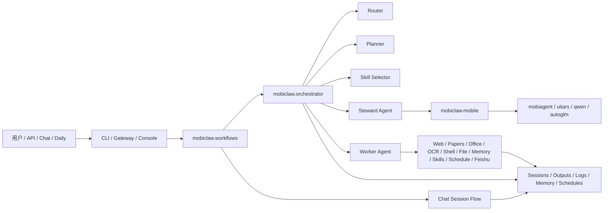

# MobiClaw 简化架构图（按当前实际代码口径）

## 1. 一页总览



## 2. Main Path

```text
Input -> Dispatch -> Route -> Plan -> Select Skills -> Execute -> Persist -> Return
```

- Input：CLI / Gateway / Chat / Daily
- Dispatch：`workflows.py`
- Route / Plan / Execute：`orchestrator.py`
- Execute：Worker 本地工具链 或 Steward -> MobiAgent
- Persist：session / outputs / RunContext / local memory
- Return：reply / files / routing_trace / execution evidence

## 3. 当前不再推荐的旧口径

以下表述不再适合描述当前项目：

- “--agent-task 默认直接 Worker”

## 4. 当前推荐口径

> MobiClaw 当前是一套以 Gateway/Chat 为入口、以 Orchestrator + Agents 为核心、以 MobiAgent 和本地状态为基础设施的多 Agent 编排系统。
