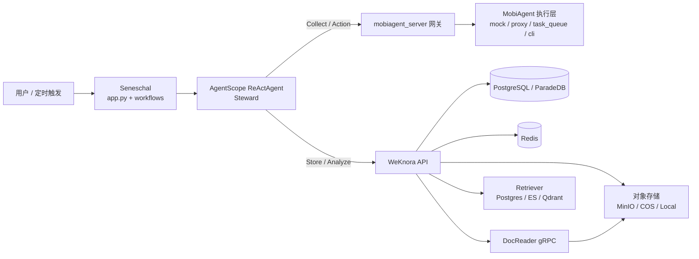

# Seneschal 简化架构图（1页版）

## 组件关系



## 运行闭环

```text
Collect -> Store -> Analyze -> Execute
```

- Collect：通过 `mobiagent_server` 调用 MobiAgent 采集手机端数据
- Store：通过 WeKnora API 写入知识库
- Analyze：通过 WeKnora 的 RAG/Agent 能力分析与总结
- Execute：根据分析结果执行手机端动作

## 各层职责

- 编排层（Seneschal）：负责流程控制、任务触发与工具调用
- 执行适配层（mobiagent_server）：统一对接不同 MobiAgent 运行方式
- 知识底座层（WeKnora）：负责知识管理、检索、会话、流式问答
- 执行层（MobiAgent）：在设备侧完成 GUI 采集和操作执行

## 详细文档

- `docs/Seneschal-项目架构说明.md`

