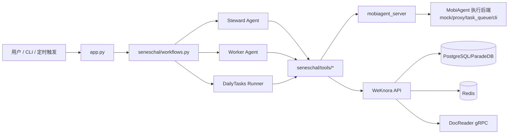

# Seneschal 简化架构图（1 页总览）

## 组件关系



## 运行闭环

```text
Collect -> Store -> Analyze -> Execute
```

- Collect：`call_mobi_collect` / `call_mobi_collect_verified`
- Store：`weknora_add_knowledge`
- Analyze：`weknora_rag_chat` / `weknora_knowledge_search`
- Execute：`call_mobi_action`

## 详细文档

- `docs/Seneschal-项目架构说明.md`
- `docs/Seneschal-详细架构图.md`
- `docs/模块-seneschal-core.md`
- `docs/模块-tools.md`
- `docs/模块-dailytasks.md`
- `docs/模块-gateway.md`
