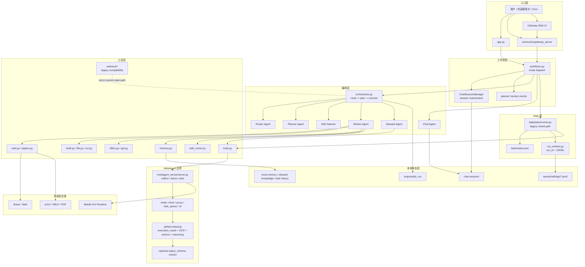
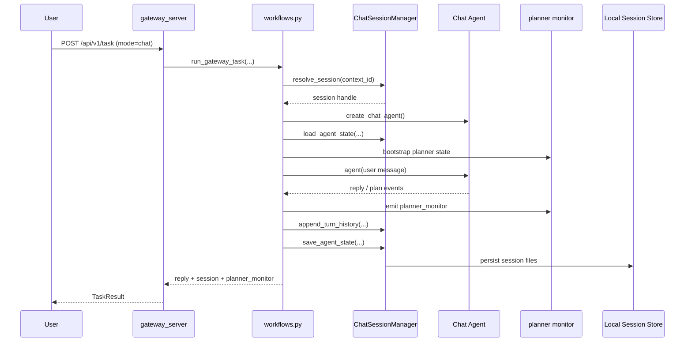
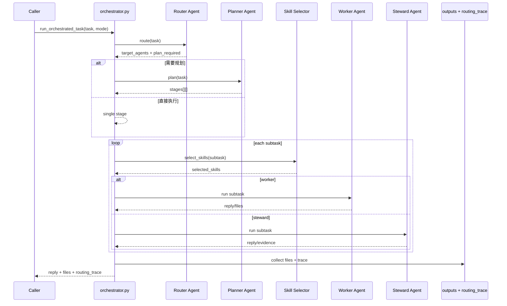
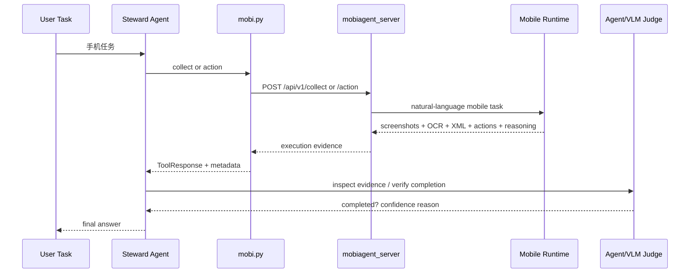

# Seneschal 详细架构图（按当前实际代码口径）

## 1. 分层组件图

## 2. Gateway / Chat 时序

## 3. Orchestrator 主时序

## 4. Steward / Mobi 时序

## 5. 当前设计结论

- 当前主架构核心是 `Gateway / Chat / Workflows / Orchestrator / Agents / MobiAgent / Local State`。
- `--agent-task` 当前默认已经走 Orchestrator，而不是旧口径里的“直接 Worker”。
- Daily 模块仍存在，但内部仍混有 legacy 路径。
- WeKnora 相关内容仍在仓库中，但不应再被画成当前主链路核心组件。
