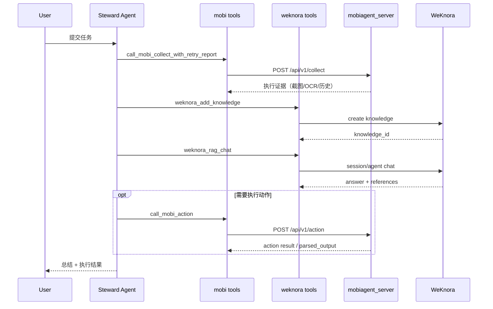

# Seneschal 详细架构图

## 1. 分层组件图

```mermaid
flowchart TB
    subgraph Entry[入口层]
      U[用户 / Cron / 外部系统]
      APP[app.py]
      U --> APP
    end

    subgraph Orchestrator[编排层 seneschal]
      WF[workflows.py\nDemo / Interactive / Daily / AgentTask]
      AG[agents.py\ncreate_steward_agent / create_worker_agent]
      RC[run_context.py\nrun_id + jsonl 事件日志]
      APP --> WF --> AG
      WF --> RC
    end

    subgraph Tasking[任务层]
      DR[dailytasks/runner.py]
      TJ[tasks/tasks.json]
      WF --> DR
      DR --> TJ
    end

    subgraph Tools[工具层 seneschal/tools]
      M1[call_mobi_collect]
      M2[call_mobi_collect_verified]
      M3[call_mobi_action]
      W1[weknora_add_knowledge]
      W2[weknora_rag_chat]
      W3[weknora_knowledge_search]
      O1[brave/arxiv/dblp/web/file/shell]

      AG --> M1
      AG --> M2
      AG --> M3
      AG --> W1
      AG --> W2
      AG --> W3
      AG --> O1
      DR --> M1
      DR --> W1
      DR --> W2
    end

    subgraph DeviceGateway[mobiagent_server]
      GAPI[FastAPI\n/api/v1/collect\n/api/v1/action\n/api/v1/jobs/*]
      GMODE[mode: mock/proxy/task_queue/cli]
      GCLI[CLI artifact indexing\nexecution_result.json + OCR]
      GSCHEMA[output_schema VLM extract]
      M1 --> GAPI
      M2 --> GAPI
      M3 --> GAPI
      GAPI --> GMODE --> GCLI
      GCLI --> GSCHEMA
    end

    subgraph Knowledge[WeKnora]
      WKAPI[Knowledge/Session/Agent API]
      WKCHAT[SSE chat streaming]
      WKENG[AgentEngine + tools]
      WKDB[(PG/ParadeDB)]
      WKREDIS[(Redis)]
      WKDOC[DocReader]
      W1 --> WKAPI
      W2 --> WKCHAT
      W3 --> WKAPI
      WKAPI --> WKDB
      WKAPI --> WKREDIS
      WKAPI --> WKDOC
      WKCHAT --> WKENG
    end

    subgraph ExternalGate[seneschal.gateway_server]
      SGW[/api/v1/task + /api/v1/jobs/{id}/]
      SGW --> AG
    end
```

## 2. 关键时序（Steward 主流程）



## 3. 关键设计点

- Seneschal 只做编排，不直接实现知识库和端侧执行引擎。
- mobiagent_server 在 CLI 模式下会生成结构化执行产物（含 OCR 和 action/react 历史）。
- Daily 任务不是通过 Steward 执行，而是 `runner.py` 直接串联工具。
- `--agent-task` 使用 Worker Agent，不经过 Steward。
