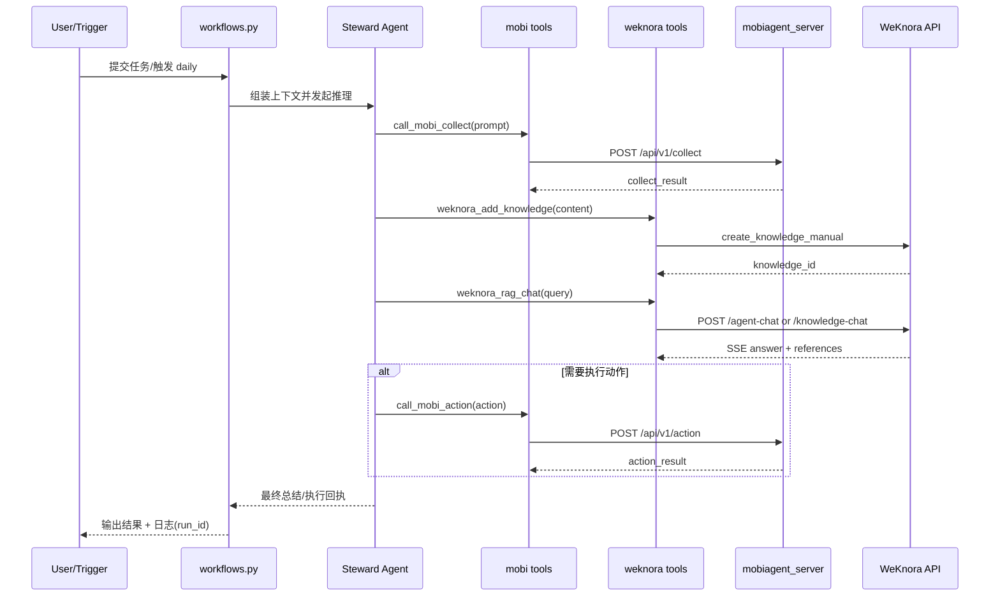

# Seneschal 新版详细架构图

本文档提供一份“可直接放入 README 的详细架构图”，用于展示当前项目在**入口层、编排层、工具层、执行层、知识层**的关系，以及关键链路时序。

---

## 1. 分层组件图（Detailed Layered Architecture）

```mermaid
flowchart TB
    subgraph Entry[入口层]
      U[用户 / Cron / CLI]
      APP[app.py]
      U --> APP
    end

    subgraph Orchestrator[编排层 Seneschal]
      WF[workflows.py\nrun_demo / interactive / daily / worker]
      AG[agents.py\nSteward(ReActAgent)]
      DT[dailytasks executor\ntrigger -> task list]
      RC[run_context.py\nrun_id + jsonl logs]
      APP --> WF --> AG
      WF --> DT
      WF --> RC
      DT --> RC
    end

    subgraph Tools[工具层 seneschal/tools]
      MCollect[call_mobi_collect]
      MAction[call_mobi_action]
      WKAdd[weknora_add_knowledge]
      WKChat[weknora_rag_chat]
      AG --> MCollect
      AG --> MAction
      AG --> WKAdd
      AG --> WKChat
      DT --> MCollect
      DT --> WKAdd
      DT --> WKChat
    end

    subgraph Gateway[执行适配层 mobiagent_server]
      API[FastAPI\n/api/v1/collect\n/api/v1/action\n/api/v1/jobs/*]
      MODE[Backend Mode\nmock / proxy / task_queue / cli]
      SCHEMA[output_schema parser\nOPENROUTER/OpenAI]
      QUEUE[queue/result/data dirs]
      MCollect --> API
      MAction --> API
      API --> MODE
      MODE --> SCHEMA
      MODE --> QUEUE
    end

    subgraph DeviceExec[设备执行层]
      MA[MobiAgent CLI]
      ALT[可替换 GUI Agent\n(UI-TARS/自定义执行器)]
      MODE --> MA
      MODE --> ALT
    end

    subgraph Knowledge[知识底座层 WeKnora]
      WKAPI[API Router/Handlers/Services]
      CHAT[SessionChat/AgentChat\nSSE Streaming]
      RET[Retriever Registry\nPostgres/ES/Qdrant]
      DOC[DocReader gRPC\nparse/split/OCR]
      ENG[Agent Engine\nMCP + WebSearch]
      PG[(PostgreSQL/ParadeDB)]
      RD[(Redis)]
      OBJ[(MinIO/COS/Local)]

      WKAdd --> WKAPI
      WKChat --> CHAT
      WKAPI --> PG
      WKAPI --> RD
      WKAPI --> DOC --> OBJ
      CHAT --> RET --> PG
      CHAT --> ENG
      ENG --> RET
    end
```

---

## 2. 核心闭环时序图（Collect -> Store -> Analyze -> Execute）



---

## 3. 说明

- 与旧版 1 页图相比，新版图增加了：`run_context`、`daily executor`、`output_schema parser`、`SSE/AgentEngine` 等关键节点。
- 建议在 README 中保留该图的链接，便于开发者快速定位“编排职责”和“执行/知识职责”边界。
