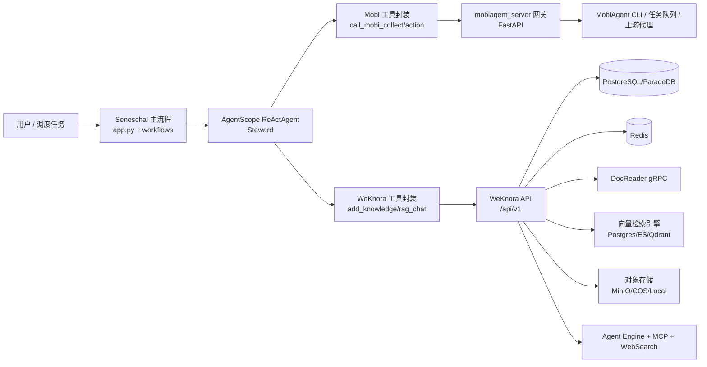
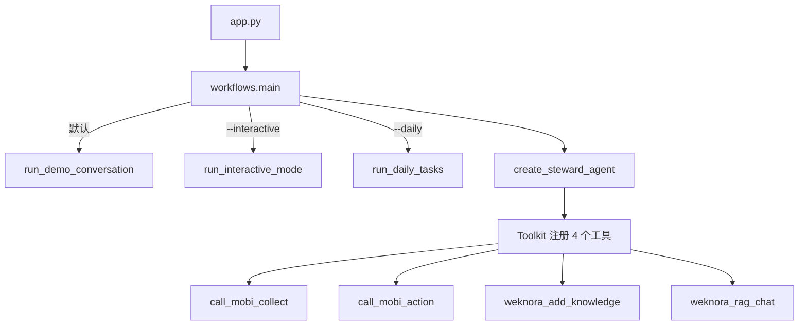
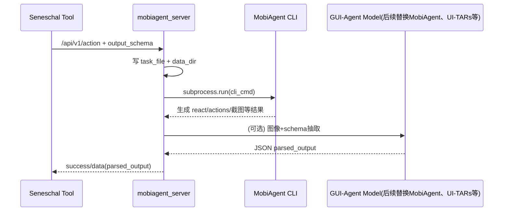
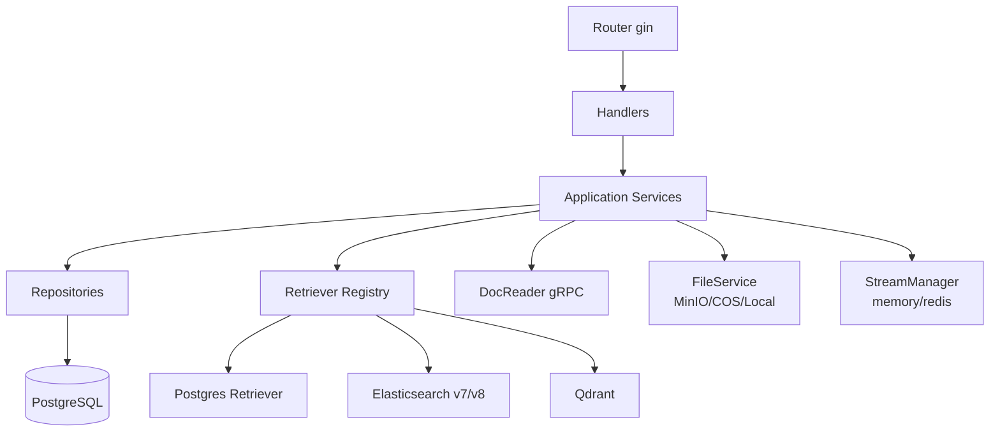
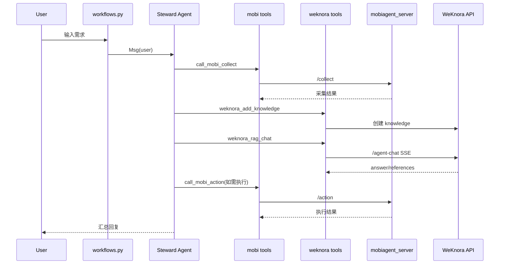

# Seneschal 项目架构说明（当前仓库实现）

## 1. 文档目的与范围

本文面向当前仓库 `Seneschal` 的实际代码实现，说明：

- 系统由哪些组件组成
- 组件之间如何协作
- 关键运行流程（启动、对话、Daily Loop、数据入库、动作执行）
- 主要配置项、数据落点与扩展点

说明范围覆盖：

- 根项目 `seneschal/`（Python 主编排）
- `mobiagent_server/`（MobiAgent 网关）
- 子模块 `WeKnora/`（知识库与 RAG 平台）
- 子模块 `MobiAgent/` 与 `agentscope/` 的集成关系

---

## 2. 总体架构（系统上下文）



关键结论：

- `Seneschal` 是“编排层”，不直接做知识检索/文档解析/手机操作执行。
- `WeKnora` 是“知识与推理底座”。
- `mobiagent_server` 是“端侧执行适配层”，屏蔽 MobiAgent 实现差异。

---

## 3. 仓库结构与职责分层

```text
Seneschal/
├── app.py                      # Python 主入口
├── seneschal/                  # 核心编排代码
│   ├── workflows.py            # 运行模式（demo/interactive/daily）
│   ├── agents.py               # ReAct Agent 与工具注册
│   ├── tools/                  # Mobi 与 WeKnora 工具封装
│   ├── dailytasks/             # 日常任务定义与执行器
│   └── run_context.py          # run_id 与 jsonl 事件日志
├── mobiagent_server/           # FastAPI 网关（collect/action）
├── scripts/                    # WeKnora 导入导出辅助脚本
├── WeKnora/                    # 子模块：知识库平台（Go + Vue + docreader）
├── MobiAgent/                  # 子模块：手机 GUI Agent 实现
└── agentscope/                 # 子模块：Agent 框架
```

分层视角：

- 接入层：`app.py`、CLI 参数入口
- 编排层：`seneschal/workflows.py` + `seneschal/agents.py`
- 工具层：`seneschal/tools/*`
- 执行适配层：`mobiagent_server/server.py`
- 知识底座层：`WeKnora/`（API、检索、会话、流式事件、存储）

---

## 4. Seneschal 核心模块关系



### 4.1 入口与运行模式

- `app.py`
  - 启动时读取根目录 `.env`（仅补充未设置的环境变量）
  - 调用 `seneschal.workflows.main()`
- `workflows.py` 支持 4 类入口：
  - 默认：演示对话
  - `--interactive`：交互式会话
  - `--daily`：按 trigger 执行日常任务采集
  - `--agent-task`：智能路由多智能体编排（Router + Planner + Executor）

其中 `--agent-task` 与 Gateway `/api/v1/task` 共享同一编排层：
- Router：决定任务优先交给 `Steward` 还是 `Worker`
- Planner：复合任务拆分为阶段子任务（可并行）
- Executor：按阶段调度多个 Agent 并聚合结果
- 兼容：仍保留 `mode=worker/steward/auto` 的 legacy 强制模式

### 4.2 Agent 层

- 使用 `AgentScope` 的 `ReActAgent`
- 系统提示词将流程固定为四步：Collect -> Store -> Analyze -> Execute
- 注册工具（`seneschal/agents.py`）：
  - `call_mobi_collect`
  - `weknora_add_knowledge`
  - `weknora_rag_chat`
  - `call_mobi_action`

### 4.3 工具层（Mobi + WeKnora）

- `seneschal/tools/mobi.py`
  - 调用网关：
    - `POST /api/v1/collect`
    - `POST /api/v1/action`
  - 请求失败时自动降级到 `mock_data`

- `seneschal/tools/__init__.py`（WeKnora 高阶封装）
  - 自动解析 KB/Agent/Session（含本地缓存 `seneschal/tools/weknora_cache.json`）
  - `weknora_add_knowledge`：
    - 通过 `create_knowledge_manual` 入库
    - 默认补当天日期标签
  - `weknora_rag_chat`：
    - 默认开启 `agent_enabled`、`web_search_enabled`
    - 404 时自动创建会话并重试

### 4.4 Daily 任务执行器

- 任务定义：`seneschal/dailytasks/tasks/tasks.json`
- 选择逻辑：按 `trigger` 过滤任务
- 执行逻辑：
  1. `call_mobi_collect(prompt)`
  2. `weknora_add_knowledge(content, metadata)`
  3. 最后统一 `weknora_rag_chat` 生成总结
- 每次运行生成 `run_id`，事件写入 `seneschal/logs/{run_id}.jsonl`

---

## 5. MobiAgent 网关（mobiagent_server）架构

`mobiagent_server/server.py` 提供稳定 API，对下兼容多种执行后端。

### 5.1 对外 API

- `POST /api/v1/collect`
- `POST /api/v1/action`
- `GET /api/v1/jobs/{job_id}`
- `POST /api/v1/jobs/{job_id}/result`
- `GET /` 健康检查

### 5.2 四种运行模式

- `mock`：返回模拟数据
- `proxy`：转发到上游 HTTP 服务
- `task_queue`：写任务文件到队列目录，异步回传结果
- `cli`：本地执行 `MOBIAGENT_CLI_CMD`

### 5.3 CLI 模式数据链



要点：

- 输出结构抽取依赖 `OPENAI_BASE_URL/OPENAI_API_KEY/OPENAI_MODEL`
- 可通过 queue/result 目录实现与执行器解耦

---

## 6. WeKnora 子系统内部架构（被 Seneschal 调用）

### 6.1 启动与依赖注入

- 启动入口：`WeKnora/cmd/server/main.go`
- DI 容器：`WeKnora/internal/container/container.go`
  - 注册配置、Tracer、DB、Redis、DocReader、检索引擎、服务、Handler、Router
  - 自动运行迁移（可由环境变量关闭）

### 6.2 核心分层



### 6.3 会话问答与事件流

- 路由：
  - `POST /api/v1/knowledge-chat/{session_id}`
  - `POST /api/v1/agent-chat/{session_id}`
- `sessionService.KnowledgeQA`：
  - 构建 `ChatManage`
  - 触发 pipeline 事件链（搜索、重排、合并、补全、流式输出）
  - 通过 EventBus + StreamManager 发 SSE 事件
- `sessionService.AgentQA`：
  - 以 custom agent 配置构建 AgentEngine
  - 注册工具（知识检索、web_search、MCP 等）并迭代执行

### 6.4 文档与知识处理

- 文档上传后由 DocReader 做解析/切分/OCR，再入库
- 检索引擎可按环境变量启用 Postgres / ES / Qdrant
- 对象存储可选 MinIO/COS/Local

---

## 7. 关键运行流程（端到端）

## 7.1 交互模式（用户聊天）



## 7.2 Daily Loop（定时巡检）

1. 读取任务清单并按 `trigger` 过滤  
2. 逐个任务调用 `call_mobi_collect`  
3. 每条结果写入 WeKnora（附 run_id/task_id 元数据）  
4. 全量收集完成后执行一次 RAG 总结  
5. 记录运行日志 JSONL，返回本次 run 报告  

## 7.3 初始化与导入导出流程

- 基础设施启动：`WeKnora/scripts/dev.sh start`
- 后端/前端本地进程：`dev.sh app`、`dev.sh frontend`
- 配置导出：`scripts/weknora_export.sh`（DB/API 混合导出）
- 配置导入：`scripts/weknora_import.sh`（导入 models/kb/custom_agents）

---

## 8. 关系矩阵（模块间依赖）

| 模块 | 直接依赖 | 产出/作用 |
|---|---|---|
| `app.py` | `seneschal.workflows` | 启动程序与模式切换 |
| `seneschal.workflows` | `agents.py`, `dailytasks.runner` | 运行时编排 |
| `seneschal.agents` | `AgentScope`, `seneschal.tools` | ReAct Agent 实例 |
| `seneschal.tools.mobi` | `mobiagent_server` | 手机数据采集/动作执行 |
| `seneschal.tools.weknora*` | `WeKnora API` | 入库、检索、会话问答 |
| `mobiagent_server` | CLI/队列/代理/VL模型 | 对下游执行器统一适配 |
| `WeKnora` | PG/Redis/DocReader/检索引擎 | 知识管理与RAG/Agent能力 |

---

## 9. 配置与运行时状态

## 9.1 Seneschal 关键环境变量

- LLM：`OPENAI_BASE_URL` `OPENAI_API_KEY` `OPENAI_MODEL`
- WeKnora：`WEKNORA_BASE_URL` `WEKNORA_API_KEY` `WEKNORA_KB_NAME` `WEKNORA_AGENT_NAME` `WEKNORA_SESSION_ID`
  - 其中 `WEKNORA_API_KEY` 会作为后续访问 WeKnora API 的认证密钥，请求头为 `X-API-Key`
- MobiAgent：`MOBI_AGENT_BASE_URL` `MOBI_AGENT_API_KEY`

## 9.2 网关关键环境变量

- `MOBIAGENT_SERVER_MODE`（mock/proxy/task_queue/cli）
- `MOBIAGENT_CLI_CMD`
- `MOBIAGENT_TASK_DIR` `MOBIAGENT_DATA_DIR`
- `MOBIAGENT_QUEUE_DIR` `MOBIAGENT_RESULT_DIR`

## 9.3 主要状态落点

- `seneschal/logs/*.jsonl`：Daily run 事件日志
- `seneschal/tools/weknora_cache.json`：KB/Agent/Session 缓存
- `mobiagent_server/tasks/`：CLI 任务文件
- `mobiagent_server/data/`：CLI 运行结果目录
- `mobiagent_server/queue/` `results/`：队列模式任务/结果

---

## 10. 典型扩展点

1. 新增采集任务  
   修改 `seneschal/dailytasks/tasks/tasks.json`，无需改动主流程。

2. 新增工具能力  
   在 `seneschal/tools/` 增加封装，并在 `seneschal/agents.py` 注册到 Toolkit。

3. 切换检索后端  
   在 WeKnora 通过 `RETRIEVE_DRIVER` 组合启用 Postgres/ES/Qdrant。

4. 增强 Agent 能力  
   通过 WeKnora custom agent 配置控制模型、工具白名单、KB 选择策略、MCP 选择策略。

---

## 11. 当前实现的关键架构特征

- “强编排、弱耦合”：Seneschal 仅负责编排，不侵入 WeKnora 与 MobiAgent 内部实现。
- “多模式容错”：Mobi 网关支持 mock/proxy/queue/cli；Seneschal 工具失败时也可 mock 回退。
- “事件流驱动”：WeKnora 问答流程以 EventBus + SSE + StreamManager 进行流式输出与可恢复续传。
- “配置驱动优先”：模型、知识库、Agent、检索策略主要由配置与 API 数据决定，而非硬编码。
